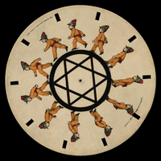
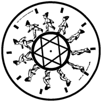
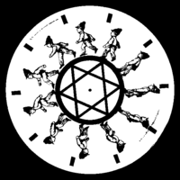
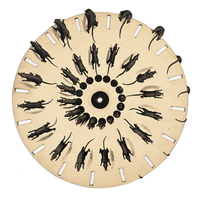
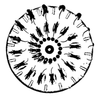
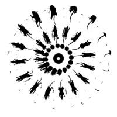

# Stroboscopes

This project creates animated GIFs of [stroboscopic discs](https://en.wikipedia.org/wiki/Phenakistiscope). The output GIF files consist of bilevel images so that they can be shown in quick succession on an e-paper display using the animation (A2) *waveform* mode, which works only with pure black and white pixels.

## Background

The source files are taken from the following pages on Wikimedia Commons:

* [Prof._Stampfer's_Stroboscopische_Scheibe_No._X.gif](https://commons.wikimedia.org/wiki/File:Prof._Stampfer%27s_Stroboscopische_Scheibe_No._X.gif) – Prof. Stampfer's Stroboscopische Scheibe No. X (Trentsensky & Vieweg 1833). Animated GIF by Joortje1.
* [Animated_phenakistiscope_disc_-_Running_rats_Fantascope_by_Thomas_Mann_Baynes_1833.gif](https://commons.wikimedia.org/wiki/File:Animated_phenakistiscope_disc_-_Running_rats_Fantascope_by_Thomas_Mann_Baynes_1833.gif) – Animated phenakistiscope disc - Running rats, Fantascope by Thomas Mann Baynes, 1833. Animated GIF by [Basile Morin](https://commons.wikimedia.org/wiki/User:Basile_Morin).

## Licenses

The file *Prof._Stampfer's_Stroboscopische_Scheibe_No._X.gif* is licensed under the [Creative Commons Attribution Share Alike 4.0 International](https://choosealicense.com/licenses/cc-by-sa-4.0/) license.

The file *Animated_phenakistiscope_disc_-_Running_rats_Fantascope_by_Thomas_Mann_Baynes_1833.gif* is in the public domain.

The other content of this project is licensed under the [GNU General Public License v3.0](https://choosealicense.com/licenses/gpl-3.0/). The animated GIF files produced by this project are licensed under the [Creative Commons Attribution Share Alike 4.0 International](https://choosealicense.com/licenses/cc-by-sa-4.0/) license.

## Building

The [Makefile](Makefile) requires the following programs on your PATH environment variable.

* **convert** – converts between image formats and edits images (from *ImageMagick*)
* **mkbitmap** – transforms images into bitmaps with scaling and filtering (from *potrace*)
* **potrace** – transforms bitmaps into vector graphics (from *potrace*)
* **inkscape** – an SVG editing program (from *Inkscape*)

## Images

This project creates the following animated GIF files:

* **stroboscope-baynes.gif** – traced with *potrace*
* **stroboscope-baynes-cutoff.gif** – created using a cutoff threshold value
* **stroboscope-stampfer.gif** – traced with *potrace*
* **stroboscope-stampfer-cutoff.gif** – created using a cutoff threshold value

A single frame from each of the original animations is converted as illustrated below. The Vector column shows the rasterization of the vector graphics created by *potrace*, while the Threshold column shows a direct conversion to black and white using a cutoff threshold value.

| Original | Vector | Threshold |
|:--------:|:------:|:---------:|
|  |  |  |
| Stampfer 800 × 800 px | 600 × 600 px | 600 × 600 px |
|  |  |  |
| Baynes 1,000 × 1,000 px | 600 × 600 px | 600 × 600 px |
